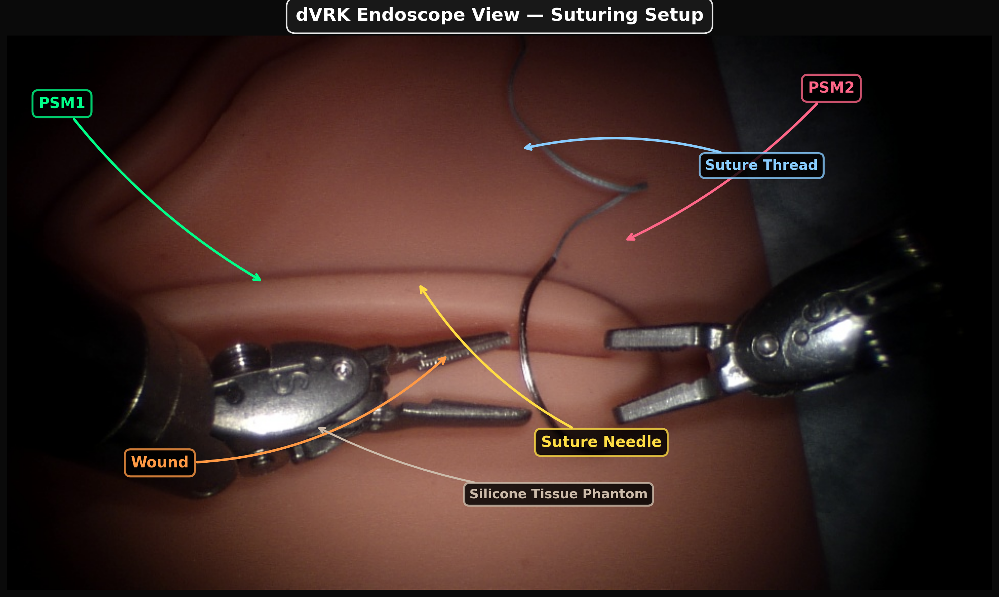
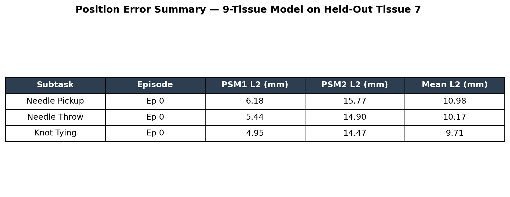
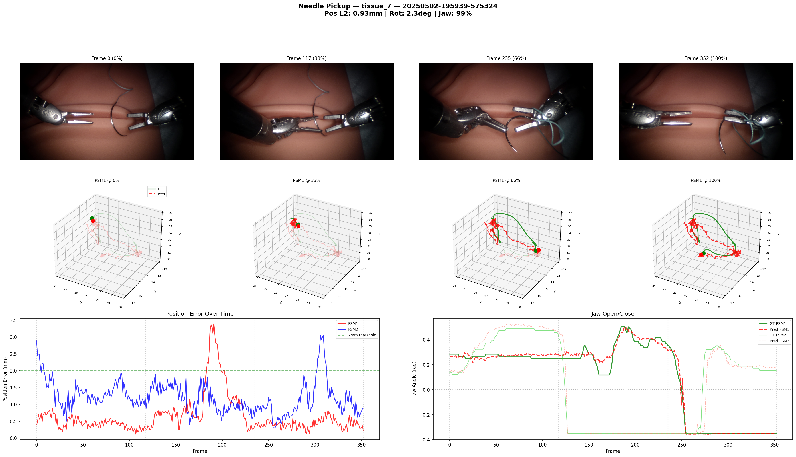
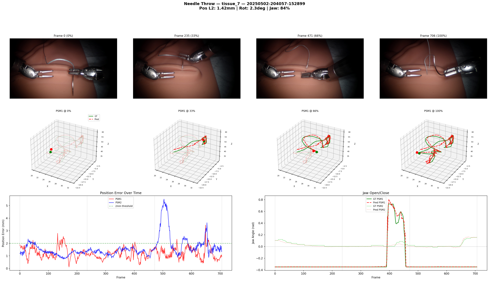
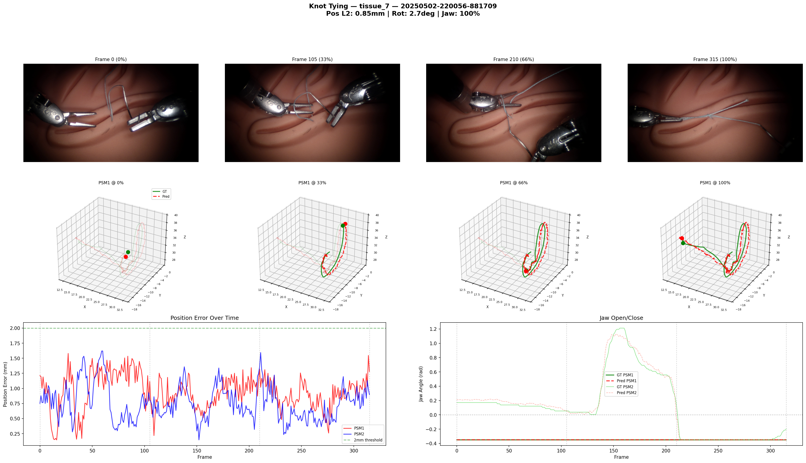
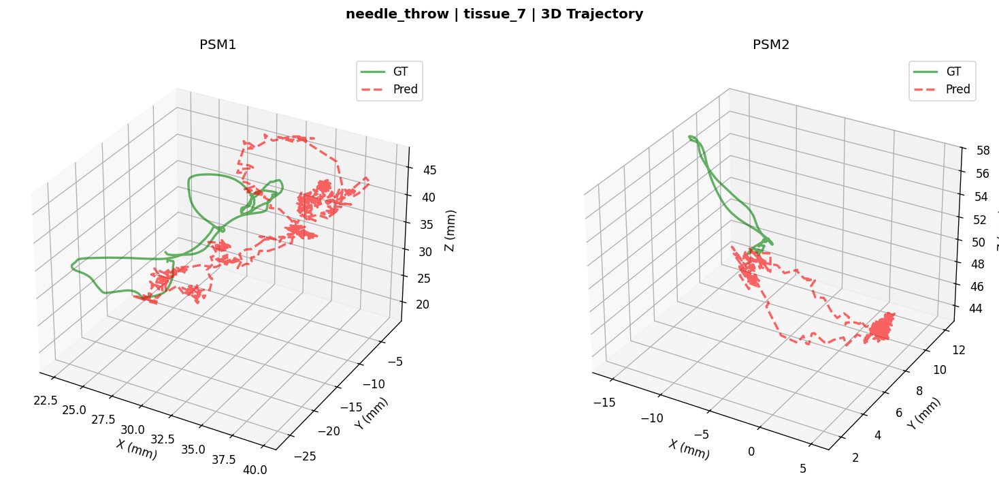
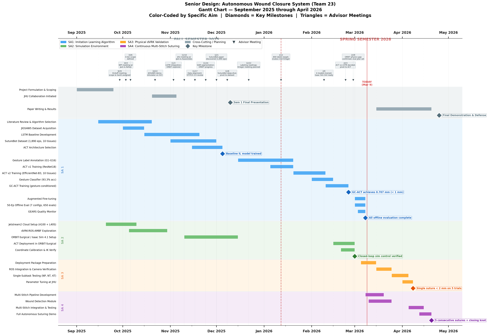

<h1 align="center">GC-ACT</h1>
<p align="center"><b>Gesture-Conditioned Action Chunking Transformer for Autonomous Robotic Suturing</b></p>

<p align="center">
  
  
  
  
  
</p>

<p align="center">
  
</p>

---

## Overview

**GC-ACT** is a gesture-conditioned imitation learning policy for autonomous suturing on the
da Vinci Research Kit (dVRK) Si platform. The system decomposes a full suture into three
subtasks &mdash; **Needle Pickup (NP)**, **Needle Throw (NT)**, and **Knot Tying (KT)** &mdash;
and trains a separate Action Chunking Transformer (ACT) per subtask, optionally conditioned
on the current JIGSAWS gesture predicted by a lightweight ResNet-18 classifier.

Trained on **1,890 episodes** across **10 tissue phantoms** from the SutureBot dataset.
Final policies achieve **sub-millimeter** mean end-effector tracking error in offline
evaluation.

---

## Results

50-episode offline evaluation, in-distribution (mean L2 EE error, mm):

| Subtask          | v1 (ResNet-18) | v2 (EfficientNet-B3) | **GC-ACT (aug)** |
|------------------|:--------------:|:--------------------:|:----------------:|
| Needle Pickup    | 1.003          | **0.809**            | &mdash;          |
| Needle Throw     | 1.242          | 0.910                | **0.803**        |
| Knot Tying       | 1.131          | 0.959                | **0.707**        |

<p align="center">
  
</p>

### Cross-tissue generalization (tissue 6 held out)

| Approach                                | KT (mm)   | NT (mm)   |
|-----------------------------------------|:---------:|:---------:|
| GC-ACT (backbone exposed to tissue 6)   | **0.904** | **0.853** |
| v6 from-scratch (truly OOD)             | 4.795     | 6.074     |

OOD performance is fundamentally limited by data diversity (7 training tissues).

---

## Visual Validation

Predicted (red) vs. ground-truth (blue) end-effector trajectories on tissue 7:

<p align="center">
  
  
  
</p>

<p align="center">
  
</p>

---

## Repository Layout

```
gcact_final/                Canonical, organized codebase
  01_model_architecture/    DETR / ACT model + backbones (ResNet, EfficientNet)
  02_training/              Training loop, dataset loader, augmentations
  03_inference/             dVRK inference + chained NP -> NT -> KT pipeline
  04_evaluation/            Offline evaluation harness
  05_visualization/         Architecture diagrams, replay videos
  06_data_processing/       Per-subtask normalization stats
  07_deployment/            JHU deployment package (setup, transfer, verify)
  08_gesture_classifier/    ResNet-18 gesture classifier (G1-G16)
  09_config_and_utils/      Constants and helpers

scripts/                    Working scripts used across the project
  training/                 Training shell scripts (v1, v2, GC-ACT, OOD)
  evaluation/               Eval runners and 50-episode definitive runs
  inference/                Multi-stitch, parameter sweep, ORBIT chained
  tools/                    GEARS quality monitor, wound detection, utilities
  visualization/            Architecture diagrams, Gantt charts, replay videos

run.py                      Unified evaluation entry point
check_training.py           Training progress monitor
```

---

## Quick Start

```bash
# Environment
source ~/miniforge3/etc/profile.d/conda.sh
conda activate act

# Train a model (see scripts/training/ for all configs)
bash scripts/training/train_gcact.sh

# Run offline evaluation
python run.py --models    # list available checkpoints
bash scripts/evaluation/run_eval_50ep.sh
```

---

## Method

| Component              | Details                                                      |
|------------------------|--------------------------------------------------------------|
| Policy backbone        | EfficientNet-B3 (v2 / GC-ACT) or ResNet-18 (v1)              |
| Action representation  | 20-D per timestep: xyz + 6D rotation + jaw, per arm          |
| Chunk size             | 60 timesteps                                                 |
| Temporal ensembling    | Exponential weighting across overlapping chunks              |
| Gesture conditioning   | One-hot G1-G16 token added to transformer encoder input      |
| Cameras                | Left endoscope + PSM1 wrist + PSM2 wrist (3 RGB streams)     |
| Augmentation           | Color jitter, random erasing, perspective warp, gaussian blur|

---

## Project Timeline

<p align="center">
  
</p>

---

## Dataset

[**SutureBot**](https://huggingface.co/datasets/jchen396/SutureBot) (CC-BY-4.0)
&mdash; 1,890 episodes, ~30 Hz, 4 cameras + 149-column kinematics CSV.
Three subtasks per episode: NP, NT, KT.
JIGSAWS-style gesture labels (G1-G16) for NT and KT across all 10 tissues
(included in this repo as referenced data).

---

## Team

Senior Design Team 23, Johns Hopkins University &mdash; **Parth Kheni**, **Swas**, **Lauren**.
Deployment target: JHU dVRK Si.

---

## Status

All training and offline evaluation complete. Next milestone: real-robot trials at JHU.
